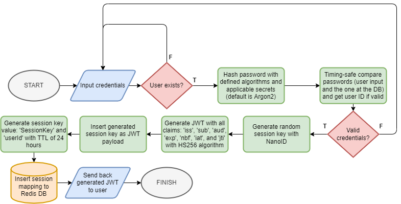
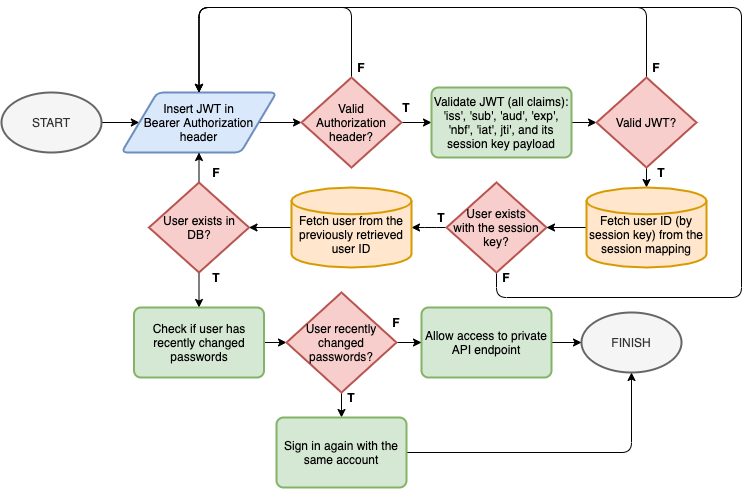

# Express Secure Auth

Simulation of my way to solve broken authentication problems with stateful JWT (RFC 7519), hashed passwords, and Redis cache.

Complete with DI, 3 Layer Architecture, integration tests and many other clean code encouragements.

As a part of the experiment, we will use a sample API in order to simulate a real use-case.

## API

The API itself is pretty straightforward and divided into several user stories.

- A user should be able to register and login.
- A logged in user should be able to perform CRUD operations on any other users.
- A non logged user should be able to get all data of users, and get a single data of a user.
- A user should receive a secure JWT token with session key once they have successfully logged in.
- A user can only access sensitive endpoints limited by rate limiters.
- A user can access general endpoints limited by rate limiters.

Endpoints existing in this API:

- `GET /`, a greeting message.
- `POST /api/v1/authentication/login`, to log in a single user.
- `POST /api/v1/authentication/register`, to register as a single user.
- `POST /api/v1/authentication/logout`, to log out. You need to be logged in to access this endpoint.
- `GET /api/v1/users`, to get all users.
- `GET /api/v1/users/<username>`, to get a user.
- `POST /api/v1/users`, to create a single user. You need to be logged in to access this endpoint.
- `PUT /api/v1/users/<uid>`, to update a single user. You need to be logged in to access this endpoint.
- `DELETE /api/v1/users/<uid>`, to delete a single user. You need to be logged in to access this endpoint.

## Authentication Flow

### Login



### Middleware



## Attack Vectors

This API will prevent:

- CSRF, as this API does not accept cookies. This API only accepts `Authorization` header with `Bearer` realm.
- MITM, if this API is run on HTTPS with a secure SSL/TLS.
- Brute-force attacks is prevented, as this API uses a strict rate-limiter and slow-down with Redis.
- Session hijacking, as this API uses a strict session token generation algorithm (JWT with strict claims and NanoID). All of the session data are stored in the server-side.
- Injection, as Redis is not an SQL and it has no concept of string escaping. The protocol uses prefixed-length strings and is completely binary safe.

Technically, DDoS-ing and stuff may still work, but the rate limiter and throttler will prevent it to the best of its ability. Guessing passwords is almost impossible as the passwords are hashed with either Argon2, BCRYPT, PBKDF2, SCRYPT, or HMAC-SHA512 with a strong randomized salt and peeper. To try to brute-force itself would be outright impossible as the API implements strict rate-limiters (unless you are using a large botnet whose IPs originate from different countries, which is a federal crime if you're installing malwares in other people's machine).

All of the attack vectors are considered according to OWASP Top 10 2021 and OWASP Top 10 (API Security).

## Prerequisites

For production, you just need Docker and a Linux distribution (to run integration tests). You also need `jq` to run said tests.

For development, you need:

- [Docker](https://www.docker.com/)
- [Node.js 16+](https://nodejs.org/en/)
- [Redis](https://redis.io/)

## Database

Redis is used for this experiment.

- `users` is a set to keep track of all users.
- `user:{id}` is a hash to store the data of a user.
- `username-uid` is a hash to keep track of unique keys - a linkage between `username` and `userId`.
- `sess:{sessionKey}` is a key value type in order to keep track of sessions. Key is a randomly generated session key, and the value is the user identification (user ID). Has an expiry time of 24 hours, same as the expiry time of the JWT.

## Features

- Simple API: registration, logging in, CRUD operations on users.
- Complete with general SE practices: error handling, graceful shutdown, code documentation, clean architecture, etc.
- Complete with API loggers which logs all requests.
- Five algorithms: `argon2`, `bcrypt`, `pbkdf2`, `scrypt`, and `sha512`. All passwords are salted with peeper (except Argon2 and BCRYPT, both have autogenerated salts).
- Secure API that checks for almost all errors and handles them accordingly.
- Complete with rate limiter and throttler to prevent brute-force attacks.
- API will always validate inputs from the request body if applicable.
- A simple RBAC: a logged in user can perform create, update, and delete operations.
- Stateful JWT to make it a replacement for ordinary session tokens.
- 3 Layer Architecture: Routers (include Validations), Services, Data Accesses.
- Dependency injection is included in this application.
- Integration tested with `curl`, `jq`, `mocha`, `nyc`, and Shell.
- Fully documented with JSDoc.
- Dockerized for quick setup (secure, non-root Docker user).

## Development

- To develop in this repository, please clone the repository first.

```bash
git clone git@github.com:lauslim12/express-secure-auth.git
```

- Install the repository.

```bash
yarn --frozen-lockfile
```

- Turn on your Redis (preferably in terminal 2), as you're going to need it. Your Redis address has to be in `localhost:6379` (default).

```bash
# installed variant
redis-cli

# docker variant
docker run -p 6379:6379 redis:latest
```

- You may set several environment variables if you want to test the password encryption algorithm with the other one. Even if you do not fill environment variables, default values are provided for you in `src/config/index.ts`.

```bash
export JWT_SECRET=randompass # you need to set this one
export PASSWORD_ALGORITHM=argon2 # you can choose 'argon2', 'bcrypt', 'pbkdf2', 'scrypt', or 'sha512'
export PASSWORD_PEEPER=randomsalt # you have to define this if you're using 'sha512', 'pbkdf2', or 'scrypt'
```

- As a note, if you change algorithms (from `sha512` to `bcrypt` for example), you need to clear your Redis database first (so there would be no mismatched hashes).

```bash
# make sure you are in redis
flushdb
```

- Run the application in development mode.

```bash
yarn dev
```

- Open the API in `http://localhost:8080` and you're done.

## Tests

There are three ways to run tests in this application.

- First way: use Docker (as described in the next section) to run the whole app and the tests.

- Second way: use a 'real' Redis, and then run the following command:

```bash
# don't forget to flush your Redis first
flushdb

# then you can run integration tests
yarn integration-test
```

- Third way: You can manually test by using `curl`, Postman, and the like in order to get to know the API responses and request requirements.

## Production

The application is meant to be run with Docker.

- Check out all environment variables as above. You may set them instantly at the `docker-compose.yml` file or you can use the `export` keyword. Using the default values are not so bad either.

- Bring the app to live by this command:

```bash
docker-compose up -d --build
```

- To run integration tests:

```bash
sh scripts/test.sh
```

- To stop the app and remove any leftovers:

```bash
docker-compose down
```

## Results

From this experiment, I conclude:

- JSON Web Tokens can be used as an alternative towards a normal session token for **stateful** authentication.
- Plain old `sha512` is much faster than key derivation algorithms like `bcrypt`, `argon2`, `pbkdf2`, and others, but `bcrypt` and `argon2` are quantum-safe and uses modified key algorithms that is cryptographically secure.
- Checking all JSON Web Tokens's claims (`iat`, `nbf`, `sub`, `iss`, `aud`, `jti`, even extra payload like `sess` in this experiment) can be an effective deterrent for an attacker. Creating a valid JWT token from nothingness is already a hard task by itself. I believe this is somewhat safer than ordinary sessions.
- Forcing a user to login again after they have changed passwords seemed like a good security measure - also a good choice to refresh tokens.
- From storage standpoint, `sess:*` key-value pairs will probably not cause any problems as it has a TTL of 24 hours. After that, it's gone.
- Using rate limiters is a good deterrent for an attacker.
- Redis is fast and definitely a good choice for authentication processes. Even if used as an ordinary database, Redis is still excellent in terms of data structure (tidiness of the data) and performance.

## Further Experiments

- Try to explore more password algorithms.
- Try to implement JWT with a public-private key pairs with ECDSA.
- Create more unit tests.

## References

- [OWASP Top 10 2021](https://owasp.org/www-project-top-ten/)
- [OWASP Top 10 2021: Detail](https://owasp.org/Top10/A00_2021_Introduction/)
- [OWASP Top 10 API Security](https://owasp.org/www-project-api-security/)
- [OWASP REST Security: Cheatsheet](https://cheatsheetseries.owasp.org/cheatsheets/REST_Security_Cheat_Sheet.html)
- [RFC 7519 (JSON Web Tokens)](https://datatracker.ietf.org/doc/html/rfc7519)
- Other compiled online documentations.
